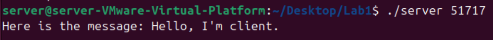
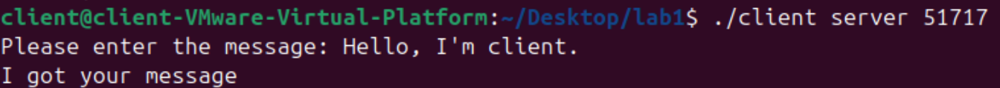
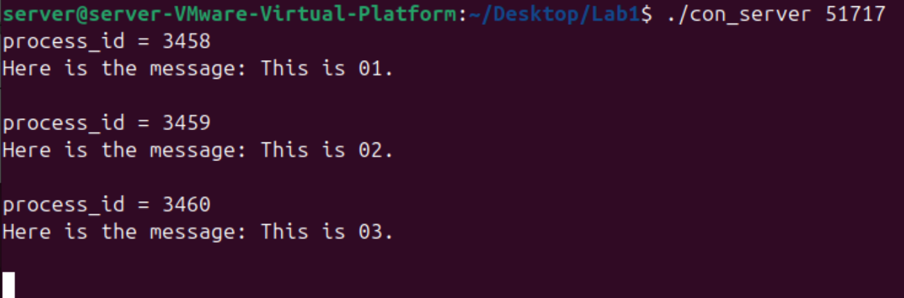
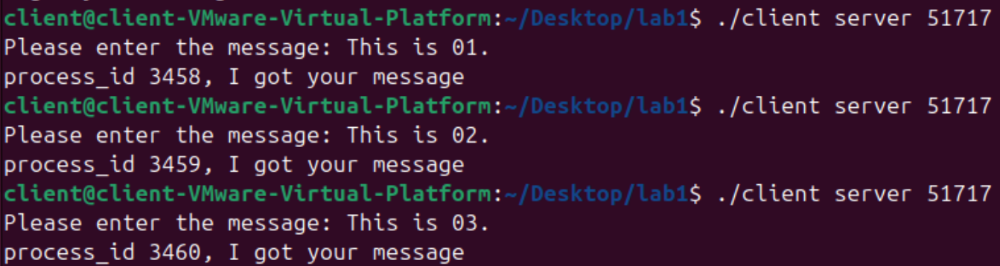
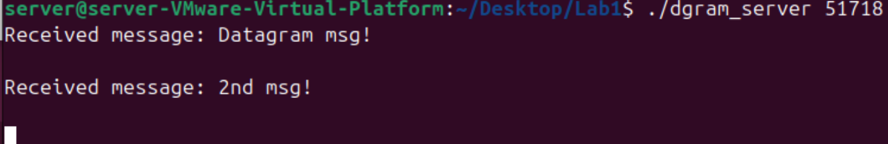
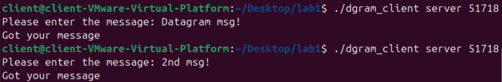
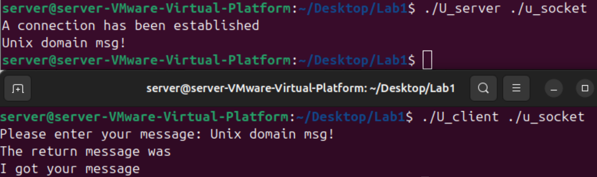
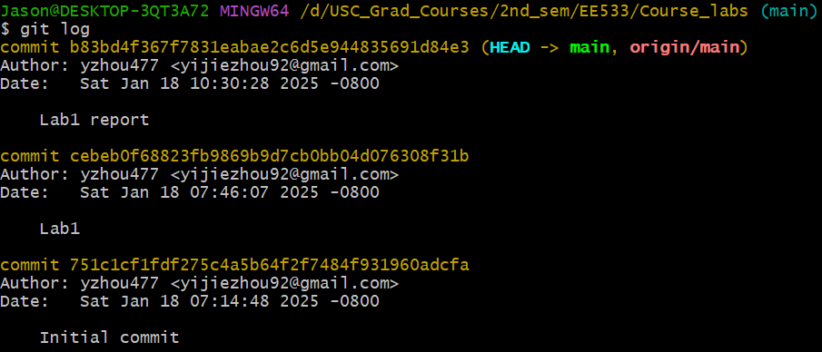

<h1 align="center"> Lab1 Report </h1>

​									*January 18, 2025*


* [Configuration of Virtual Machine](#1)
* [Test and Modification of Code](#2)
* [GitHub link and record of commits](#3)


<h4 id="1"> Configuration of Virtual Machine </h4>

1. Create two Linux VMs in Vmware, a Server and a Client.

2. Configure the network adapter.

   |      Server      |    Client     |
   | :--------------: | :-----------: |
   | Bridged + Vmnet2 |    Vmnet2     |
   |  192.168.2.129   | 192.168.2.128 |


<h4 id="2"> Test and Modification of Code </h4>

1. Test the server.c and client.c

   

   

2. Enhancements to the server code

   accept() and fork() in an infinite loop:

   ```` c
   /* con_server.c */
   while (1) { 
   		newsockfd = accept(sockfd, (struct sockaddr *) &cli_addr, &clilen); 
   		if (newsockfd < 0) 
   		error("ERROR on accept"); 
   		pid = fork(); 
   		if (pid < 0) 
   			error("ERROR on fork"); 
   		if (pid == 0) { 
   			close(sockfd); 
   			read_ac(newsockfd); 
   			exit(0); 
   		 } 
   		else 
   			close(newsockfd); 
   	 }
   ````

   

   actions in read_ac():

   ```` c
   /* con_server.c */
   void read_ac(int child_sockfd)
   {
   	 char rbuffer[256], wbuffer[36];
   	 char *sendmsg = "I got your message";
   	 int n, pid;
   	 bzero(rbuffer,256);
   	 bzero(wbuffer,36);
        n = read(child_sockfd,rbuffer,255);
   	 pid = getpid();
   	 printf("process_id = %d \n", pid);
        if (n < 0) error("ERROR reading from socket");
        printf("Here is the message: %s\n",rbuffer);
        sprintf(wbuffer, "process_id %d, %s", pid, sendmsg);
        n = write(child_sockfd, wbuffer, 35);
        if (n < 0) error("ERROR writing to socket");
   }
   ````

   

   the result of test:

   

   

3. Handle zombie processes

   ````c
   /* con_server.c */
   void *SigCatcher(int n) 
   { 
   	wait3(NULL, WNOHANG, NULL); 
   }
   
   int main(int argc, char *argv[])
   {
        ...
   	 signal(SIGCHLD, SigCatcher);
        ...
   ````

   

   

4. Datagram Socket

   Use SOCK_DGRAM instead of SOCK_STREAM

   ````c
   /* dgram_server.c */
   sockfd = socket(AF_INET, SOCK_DGRAM, 0);
   ````

   

   No connect()

   Use recvfrom(), sendto() instead of read() write()

   ````c
   /* dgram_sever.c */
   while (1) {
           bzero(buffer, 256);
           n = recvfrom(sockfd, buffer, 255, 0, (struct sockaddr *) &cli_addr, &clilen);
           if (n < 0) 
               error("ERROR on recvfrom");
           printf("Received message: %s\n", buffer);
           n = sendto(sockfd, "Got your message", 17, 0, (struct sockaddr *) &cli_addr, clilen);
           if (n < 0) 
               error("sendto");
       }
   ````

   

   the result of test

   

   

   

5. Sockets in the Unix Domain 

   the result of test

   

   

<h4 id="3"> GitHub link and record of commits </h3>

https://github.com/yzhou477/USC_EE533.git

