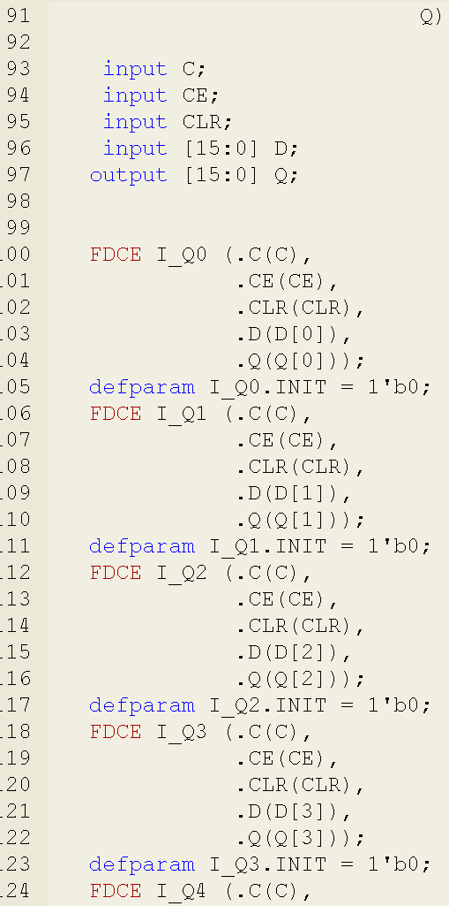
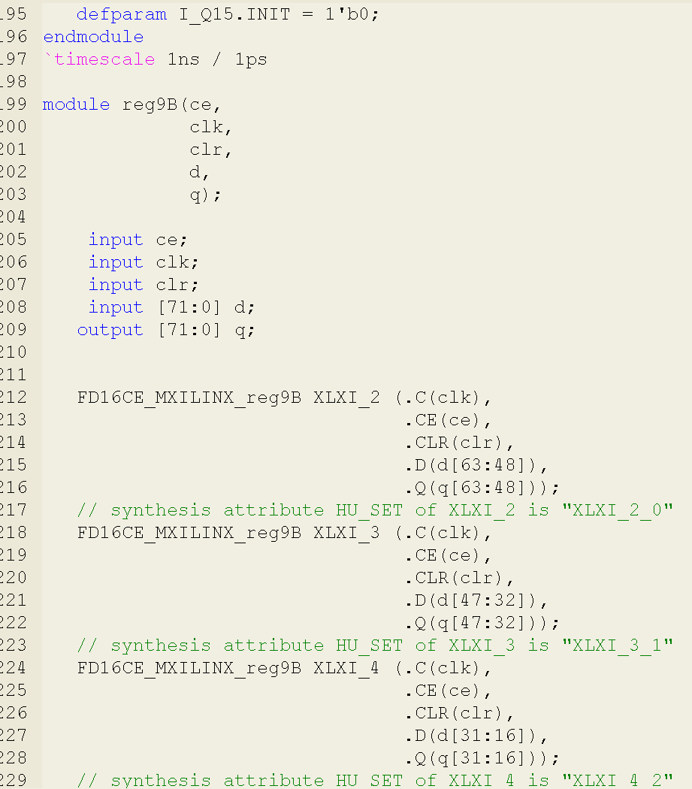
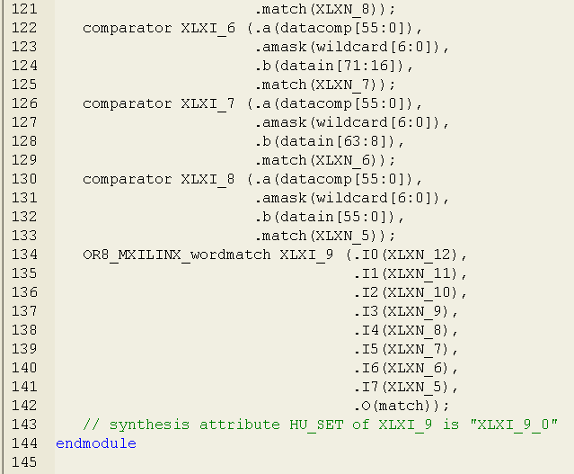
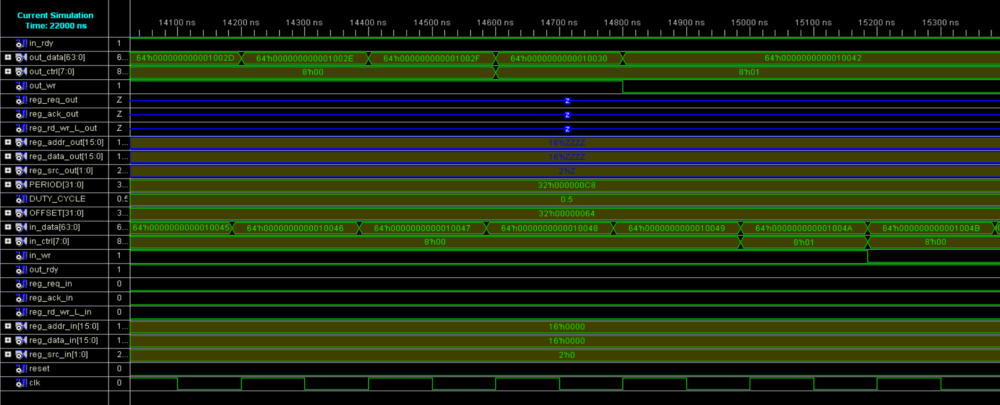

# Lab3 report

* [Pattern Matching Algorithm](#1)
* [QA](#2)
* [Schematics](#3)
* [Generated Verilog](#4)
* [Testbench and Waveform](#5)

<h4 id="1"> Pattern Matching Algorithm </h4>

1. Get a 112 bits data block by concatenating the lower 48 bits of the previous packet data with the lower 64 bits of the current packet data;
2. Divide the 112 bits data block into 8 consecutive 56 bits segments;
3. Each segment is compared against a fixed 56-bit pattern, where bytes at positions where amask(x) equals 0 can be ignored during comparison;
4. hwregA[62:56] acts as the amask[6:0], the default of amask[6:0] is 7'b 1111111;
5. Only when a segment matches the pattern, match_en is 1, mrst is 0, and no match was found in the previous packet, the 'match' signal is set to 1;

<h4 id="2"> QA </h4>

1. amask[6:0] is a 7-bit mask. If amask[x] == 0, the corresponding xth byte in the data being compared can be ignored.
2. busmerge module concatenates the lower 48 bits of the previous packet data with the lower 64 bits of the current packet data.
3. The comp8 module compares two 8 bits data, and sets 'EQ' to 1 only when all bits between them match perfectly.
4. The dual9Bmem is used to store the packet data that is not dropped. And these data can be accessed.

<h4 id="3"> Schematics </h3>

Comparator

detect7B

dropfifo

wordmatch

reg9B

<h4 id="4"> Generated Verilog </h4>

comparator

reg9B

wordmatch

detect7B

dropfifo

<h4 id="5"> Testbench and Waveform </h4>

testbench mainly changes the values of in_data[63:0], in_ctrl[7:0], in_wr, and out_rdy to observe the changes in the output values. It can be seen that when in_wr == 0 and out_rdy == 0, the corresponding input value is not output (not stored); when the input value is 64'h 0000000000000007, the pattern matches and is not output.