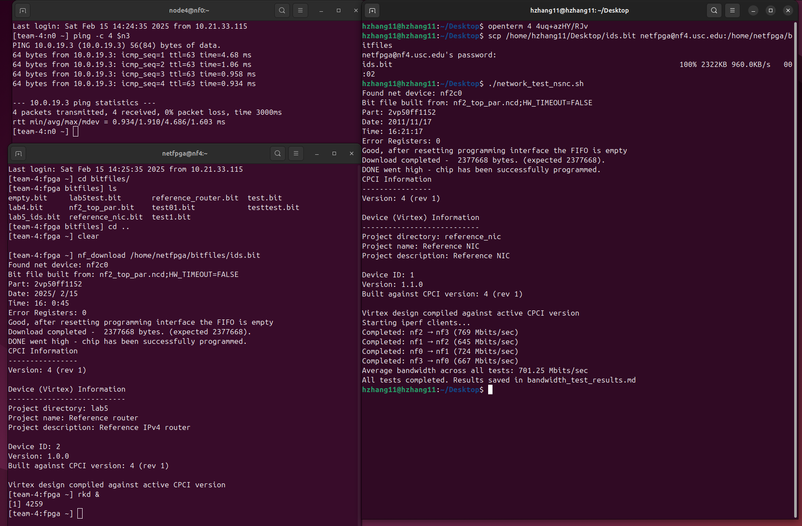

# Lab5 Report

**Remote repository address : https://github.com/hzhang2422/EE-533-Team4**

Members: Yijie Zhou, Jiahe Wu, Haoyang Zhang, Bohan Fang

### Step1 

- Insert a passthrough ids.v into the NetFPGA reference Router  package that simply connects all of the modules’ input to output with “wire” type variable.

  

- Compile the  source and generate the bitfile Download the generated bitfile(test) into the fpga node  using Linux command line tools like scp.

  

- Reconfigure the FPGA with the generated bitfile and make  sure that it is functionally the same as the reference bitfiles. 

  

  

### Step2

-  Add the components from the mini-IDS design from Lab3.

  

  - user_data_path

    - input_arbiter

      

    - output_port_lookup

      

    - ids

      

    - output_queues

      

  - ids

    

- Compile and test.

  

### Step3

- Copy the script to the fpga node  and make sure it is executable.

  

  This Perl script isused for interacting with the IDS registers in the NetFPGA system, providing functionalities for writing to registers, reading from registers, and resetting them.

- The netfpga compiler assigned  register address are:

  

- reset and writeswreg test:

  

### Step 4:

## QUESTIONS

1. **There is a bug when the mini-IDS is passing traffic at near gigabit speeds. What is the bug?**

   When Mini-IDS processes traffic at speeds approaching 1Gbps, a bug occurs where it potentially loses packets. Because high-speed traffic can overwhelm the data pipeline, causing UDP packets to be lost since they cannot be retransmitted. In contrast, TCP traffic may mask this issue by utilizing retransmission mechanisms. To prevent Mini-IDS from dropping packets at near-gigabit speeds, we have two solutions (only list two but not the only possible solutions):

   1)Increase the FIFO buffer size to better regulate data flow and prevent overflow.

   2)Insert a one-clock-cycle delay to synchronize data, reducing timing issues that may contribute to packet loss.
   Therefore, the data stability can be improved and the risk of packet loss under high-speed traffic conditions could be reduced.

   

2. **Explain in brief how the mini-IDS works and how it interacts with the other modules in the NetFPGA.  Be clear and concise!  Write as if you are describing the mini-IDS project on a webpage where other  NetFPGA developers will read about your design.**

   The mini-IDS is made up of a fallthrough fifo, a malicious pattern detection module, and a dropfifo. It's used to detect a malicious pattern within the data packets. The input of mini-IDS is 72 bits, including 8 bits control bits and 64 bits data bits. The input data will firstly go through the fallthrough fifo and then go into the malicious pattern detection module. If the malicious pattern is not found in the packet, then the packet will go into the drop fifo and then will be forwarded by the drop fifo. Otherwise, the packet will be dropped by the drop fifo. The mini-IDS is inserted into the NetFPGA HardWare Router. It is assembled between output port lookup stage and ouput queens stage. It is used to ensure output packets from output port lookup module safely forwarding to output queens.

   

3. **Explain the pattern matching algorithm.**

   (1)Get a 112 bits data block by concatenating the lower 48 bits of the previous packet data with the lower 64 bits of the current packet data;

   (2)Divide the 112 bits data block into 8 consecutive 56 bits segments;

   (3)Each segment is compared against a fixed 56-bit pattern, where bytes at positions where amask(x) equals 0 can be ignored during comparison;

   (4)hwregA[62:56] acts as the amask[6:0];

   (5)Only when a segment matches the pattern, match_en is 1, mrst is 0, and no match was found in the previous packet, the 'match' signal is set to 1;

   

4. **Draw a high-level design of the user_data_path.v and ids.v Verilog files. The figure should depict the  communication between the components.**

   user_data_path.v

   

   ids.v

   

