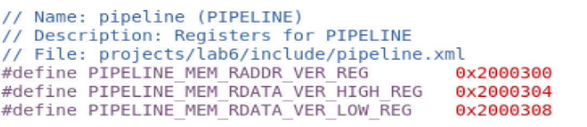
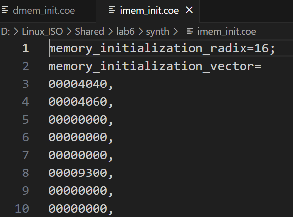
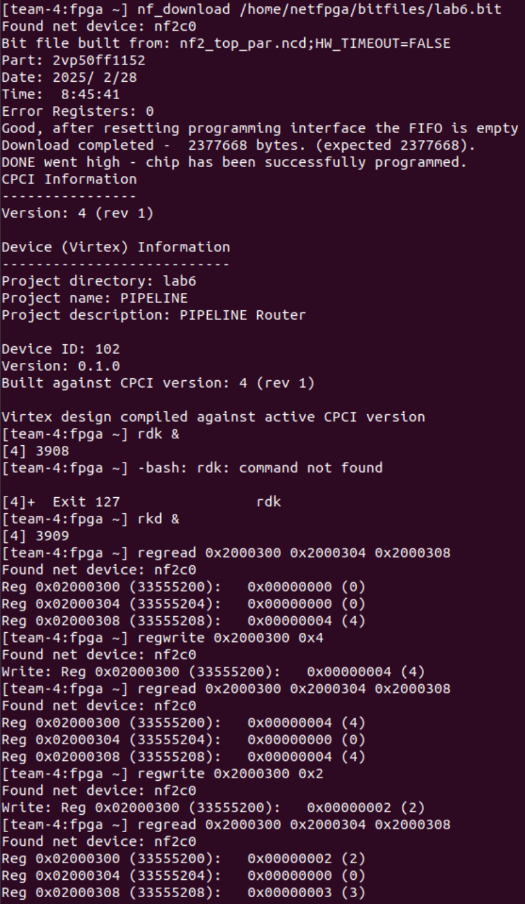

# Lab6 Report

**Remote repository address : https://github.com/hzhang2422/EE-533-Team4**

Members: Yijie Zhou, Jiahe Wu, Haoyang Zhang, Bohan Fang


### Part1 :  64bit ALU

- Function:

4'b0000 add (implemented by CLA)
4'b0001 substract
4'b0010 bitwise AND
4'b0011 bitwise OR
4'b0100 bitwise XNOR
4'b0101 compare
4'b0110 logic left-shift
4'b0111 logic right-shift
4'b1000 substring comparison
4'b1001 left-shift-then-compare(STC)
4'b1010 right-shift-then-compare(STC)

- Waveform:


- Result table

| A(63:0)              | B(63:0)              | alustrl(3:0) | Z(63:0)              | comments                      |
| -------------------- | -------------------- | ------------ | -------------------- | ----------------------------- |
| 64'd20               | 64'd30               | 4'b0000      | 64'd50               | overflow=0                    |
| 64'd50               | 64'd20               | 4'b0001      | 64'd30               | overflow=0                    |
| 64'hFF00FF00FF00FF00 | 64'h0F0F0F0F0F0F0F0F | 4'b0010      | 64'h0f000f000f000f00 |                               |
| 64'hFF00FF00FF00FF00 | 64'h0F0F0F0F0F0F0F0F | 4'b0011      | 64'hff0fff0fff0fff0f |                               |
| 64'hAAAAAAAAAAAAAAAA | 64'h5555555555555555 | 4'b0100      | 64'h0000000000000000 |                               |
| 64'd100              | 64'd100              | 4'b0101      | 64'h0000000000000001 |                               |
| 64'd100              | 64'd50               | 4'b0101      | 64'h0000000000000000 |                               |
| 64'd1                | 64'd3                | 4'b0110      | 64'd8                |                               |
| 64'd16               | 64'd2                | 4'b0111      | 64'd4                |                               |
| 64'h000000000000ABCD | 64'h000000000000ABCD | 4'b1000      | 64'h0000000000000001 | SUB_START = 0  SUB_WIDTH = 16 |
| 64'd3                | 64'd2                | 4'b1001      | 64'h0000000000000001 | cmp_val = 64'd12              |
| 64'd32               | 64'd3                | 4'b1010      | 64'h0000000000000001 | cmp_val = 64'd4               |


### Part 2 :  Register File and Memories

- Register File Design (32 registers that are 64-bit wide )
  - code
  
    
  
    
  
  - simulation
  
    
  
    
  
- Instruction Memory (BRAM-based dual-port synchronous memory of 32-bit width and  512 depth)
  - code
  
    
  
  - simulation
  
    
  
- Data Memory (BRAM-based dual-port synchronous memory of 64-bit wide data I/O with  256 entries)
  - code
  
    
  
    
  
  - simulation
  
    

### Part 3 :  Pipeline Datapath

- Instruction Format

  | Unused(16bit) | WMemEn (1bit) | WRegEn(1bit) | Rs(3bits) | Rt(3bits) | Rd(3bits) | Unused(rest) |
  | ------------- | ------------- | ------------ | --------- | --------- | --------- | ------------ |

  
  
- Data Memory

  | Addr | Value                   |
  | ---- | ----------------------- |
  | 0    | 64'h0000_0000_0000_0004 |
  | 1    | 64'h0000_0000_0000_0002 |
  | 2    | 64'h0000_0000_0000_0003 |
  | 3    | 64'h0000_0000_0000_0064 |
  | 4    | 64'h0000_0000_0000_0005 |
  | 5    | 64'h0000_0000_0000_0006 |
  | 6    | 64'h0000_0000_0000_0007 |
  | 7    | 64'h0000_0000_0000_0008 |

  

- Instruction Memory

  | Addr | WMemEn | WRegEn | Rs   | Rt   | Rd   | Comments     |
  | ---- | ------ | ------ | ---- | ---- | ---- | ------------ |
  | 0    | 0      | 1      | 000  | 000  | 010  | ld R2, 0(R0) |
  | 1    | 0      | 1      | 000  | 000  | 011  | ld R3, 0(R0) |
  | 2    | 0      | 0      | 000  | 000  | 000  | Noop         |
  | 3    | 0      | 0      | 000  | 000  | 000  | Noop         |
  | 4    | 0      | 0      | 000  | 000  | 000  | Noop         |
  | 5    | 1      | 0      | 000  | 010  | 011  | st R3, 0(R2) |
  | 6    | 0      | 0      | 000  | 000  | 000  | Noop         |
  | 7    | 0      | 0      | 000  | 000  | 000  | Noop         |

  

- Simulation

  


### Part 4 : Integrating the Pipeline into NetFPGA

- SW/HW interface in pipeline module

  - Verilog module

    ````verilog
    	// pipeline_netfpga.v
    
    	// Software registers
    	wire [7:0]									mem_raddr_ver;
    
       	// Hardware registers
      	wire [63:0]								   	mem_rdata_ver;
    	wire [31:0]								   	mem_rdata_ver_high;	
       	wire [31:0]								   	mem_rdata_ver_low;
    
    	// Verification(D-MEM)
    	assign mem_rdata_ver = dmem_rdata;
       	assign mem_rdata_ver_low = mem_rdata_ver[63:32];
       	assign mem_rdata_ver_high = mem_rdata_ver[31:0];
    
    	// ......
    
    	generic_regs
       #( 
          .UDP_REG_SRC_WIDTH   (UDP_REG_SRC_WIDTH),
          .TAG                 (`PIPELINE_BLOCK_ADDR),          // Tag -- eg. MODULE_TAG
          .REG_ADDR_WIDTH      (`PIPELINE_REG_ADDR_WIDTH),     // Width of block addresses -- eg. MODULE_REG_ADDR_WIDTH
          .NUM_COUNTERS        (0),                 // Number of counters
          .NUM_SOFTWARE_REGS   (1),                 // Number of sw regs
          .NUM_HARDWARE_REGS   (2)                  // Number of hw regs
       ) module_regs (
          .reg_req_in       (reg_req_in),
          .reg_ack_in       (reg_ack_in),
          .reg_rd_wr_L_in   (reg_rd_wr_L_in),
          .reg_addr_in      (reg_addr_in),
          .reg_data_in      (reg_data_in),
          .reg_src_in       (reg_src_in),
    
          .reg_req_out      (reg_req_out),
          .reg_ack_out      (reg_ack_out),
          .reg_rd_wr_L_out  (reg_rd_wr_L_out),
          .reg_addr_out     (reg_addr_out),
          .reg_data_out     (reg_data_out),
          .reg_src_out      (reg_src_out),
    
          // --- counters interface
          .counter_updates  (),
          .counter_decrement(),
    
          // --- SW regs interface
          .software_regs    (mem_raddr_ver),
    
          // --- HW regs interface
          .hardware_regs    ({mem_rdata_ver_high, mem_rdata_ver_low}),
    
          .clk              (clk),
          .reset            (reset)
        );
    ````

    

  - Registers Mapping

    

- Registers in pipeline.xml

  ```` xml
  <?xml version="1.0" encoding="UTF-8"?>
  <nf:module xmlns:nf="http://www.NetFPGA.org/NF2_register_system" xmlns:xsi="http://www.w3.org/2001/XMLSchema-instance" xsi:schemaLocation="http://www.NetFPGA.org/NF2_register_system NF2_register_system.xsd ">
  	<nf:name>pipeline</nf:name>
  	<nf:prefix>pipeline</nf:prefix>
  	<nf:location>udp</nf:location>
  	<nf:description>Registers for PIPELINE</nf:description>
  	<nf:blocksize>64</nf:blocksize>
  	<nf:registers>
  		<nf:register>
  		  <nf:name>mem_raddr_ver</nf:name>
  			<nf:description>D-MEM Read Address</nf:description>
  			<nf:type>generic_software32</nf:type>
  		</nf:register>
  		<nf:register>
  		  <nf:name>mem_rdata_ver_high</nf:name>
  			<nf:description>Upper 32 bits of D-MEM Read Data</nf:description>
  			<nf:type>generic_hardware32</nf:type>
  		</nf:register>
          	<nf:register>
  		  <nf:name>mem_rdata_ver_low</nf:name>
  			<nf:description>Lower 32 bits of D-MEM Read Data</nf:description>
  			<nf:type>generic_hardware32</nf:type>
  		</nf:register>
  	</nf:registers>
  </nf:module>
  
  ````

- I-MEM initialization with .coe

  

- D-MEM initialization with .coe

  

- Demonstrate the working of the datapath with NetFPGA

  

